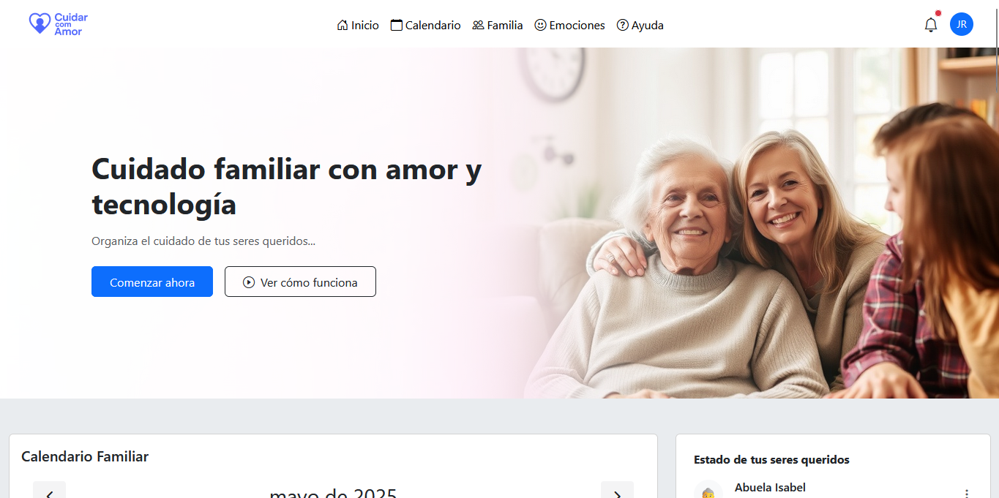
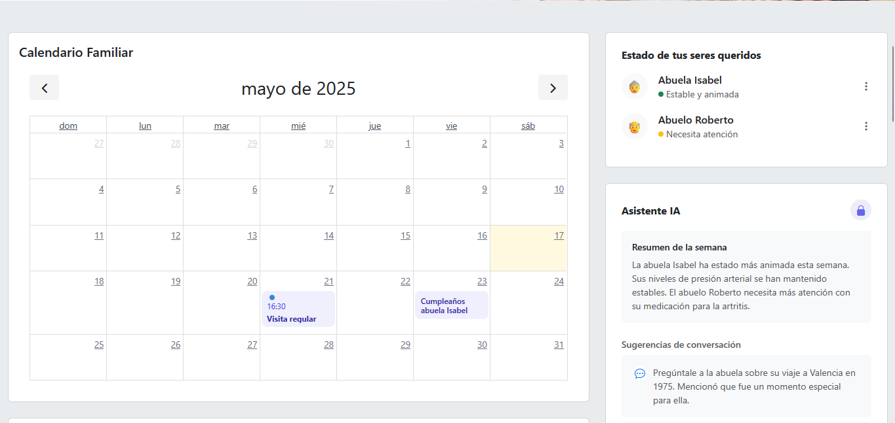
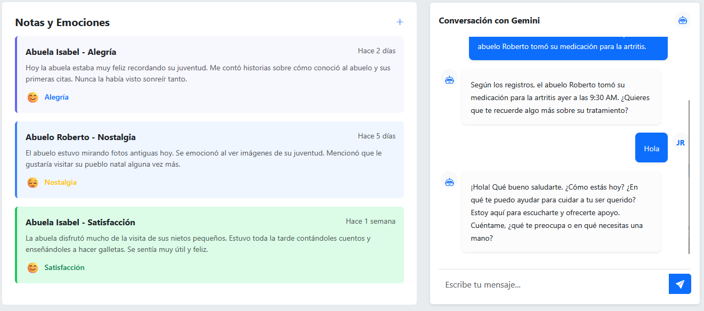
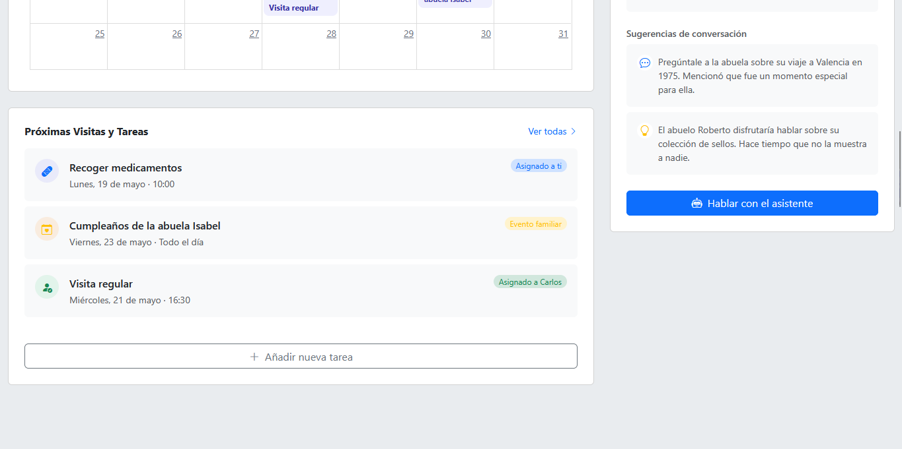
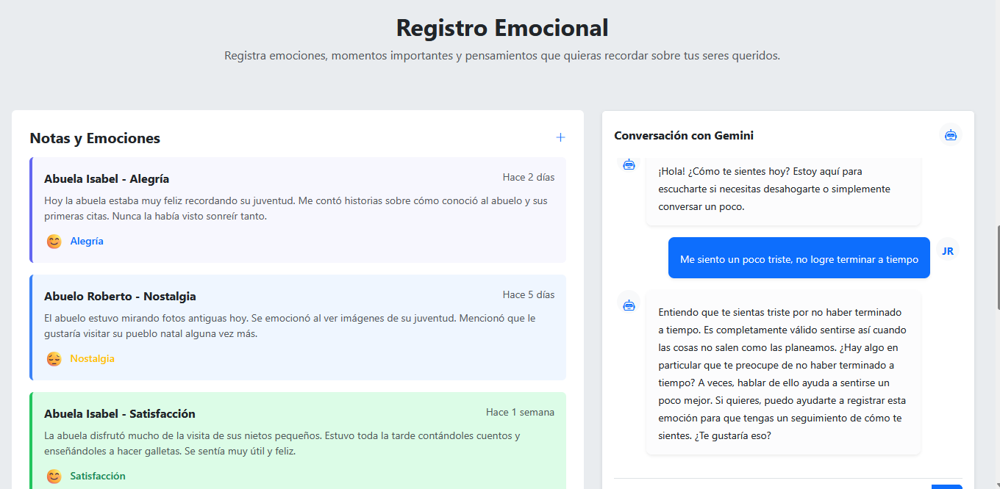
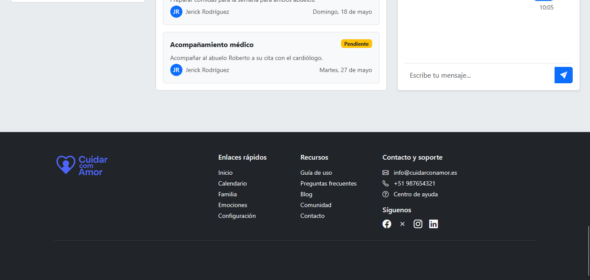
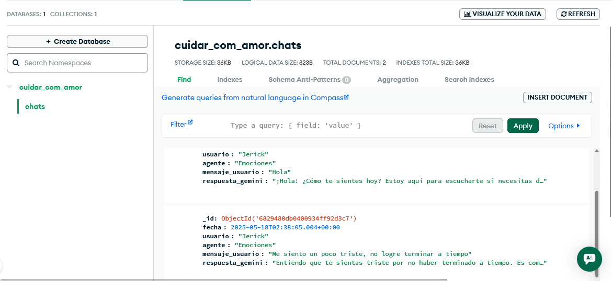

# 🧡 Cuidar com Amor

**Cuidar com Amor** es una plataforma asistida por inteligencia artificial (Google Gemini Agents) diseñada para ayudar a las familias a organizar el cuidado de sus abuelos de forma amorosa, eficiente y conectada.

---

## 🎯 Objetivo

Brindar una solución tecnológica accesible y empática que permita a los familiares:

- Coordinar visitas, tareas médicas y rutinas.
- Recibir resúmenes automáticos del estado emocional y físico de los abuelos.
- Obtener ideas para fortalecer el vínculo afectivo a través de conversaciones.
- Registrar notas emocionales, fechas clave y recordatorios importantes.

---

## 💡 Características Clave

- 🧠 Agentes personalizados usando Gemini para interacción emocional y coordinación.
- 💬 Ideas de conversación significativa generadas por IA.
- 📌 Registro de emociones, recuerdos y seguimiento emocional.
- 📊 Backend escalable con MongoDB para almacenamiento de notas y chats.
- ✅ Integración en Google Colab funcional para pruebas directas.

---

## ⚙️ Tecnologías Utilizadas

### Frontend
- HTML, CSS, JavaScript
- Bootstrap 5
- Vite (opcional para desarrollo moderno)

### Backend
- Python 3 + Flask
- Google Generative AI (Gemini Agents)
- MongoDB Atlas
- Flask Blueprints
- Pymongo, dotenv, Google Auth

---

## 🚧 Limitaciones del Proyecto

Al ser mi primera experiencia trabajando con Google Gemini Agents en Python, me enfrenté a múltiples desafíos:

- No logré completar la integración con Google Calendar debido a errores de credenciales y formato.
- En el backend con Flask, solo está plenamente funcional el **agente de emociones** (`/api/emociones`) que guarda en MongoDB y responde correctamente.
- La integración completa de agentes en Flask se vio limitada por restricciones de entorno, asincronía y parsing de herramientas.
- Sin embargo, en la versión **Google Colab** (`colab/Cuidar_com_Amor.ipynb`), están funcionales tres agentes:
  - Registro de emociones
  - Generación de resúmenes de cuidado
  - Ideas para conversaciones significativas

Tuve que apoyarme en subtítulos en portugués para poder comprender las clases, ya que no domino completamente el idioma. A pesar de todo, seguí adelante con esfuerzo, cariño y mucha dedicación.

---

## 🚀 Instalación y Ejecución

### 📦 Clonar el Proyecto

```bash
git clone https://github.com/Jerick97/Cuidar-com-Amor.git
cd cuidar-com-amor
```

### 🔧 Backend (Flask)

```bash
cd backend
python -m venv venv
source venv/bin/activate   # Windows: venv\Scripts\activate
pip install -r requirements.txt
```

Crea un archivo `.env` con tu configuración:

```env
GOOGLE_API_KEY=tu_api_key_de_gemini
MONGODB_URI=tu_mongodb_uri
```

Ejecuta la app:

```bash
flask run
```

---

## 🧪 Cómo Usar

- Ejecuta el cuaderno `colab/Cuidar_com_Amor.ipynb` si deseas probar los agentes directamente desde Google Colab.
- Puedes registrar emociones, generar resúmenes o pedir ideas de conversación.
- Desde la API Flask local también puedes enviar emociones a `/api/emociones` y se guardan automáticamente en MongoDB.

---

## 🌍 Público Objetivo

- Jóvenes y adultos que desean cuidar a sus abuelos de forma remota.
- Familias que coordinan el cuidado de un ser querido.
- Instituciones que buscan integrar IA en sistemas de asistencia emocional.

---

## 🔮 Futuras Funcionalidades

- Reconocimiento de voz para notas rápidas.
- Dashboard para cuidadores y monitoreo familiar.

---

## 🤝 Contribuciones

¡Toda ayuda es bienvenida! Puedes enviar Pull Requests o abrir Issues con sugerencias, mejoras o reportes de errores.

---

## 🧠 Autor

Proyecto desarrollado por **Emerson** para el desafío de inmersión **Alura + Google Gemini**.

> _"La mejor forma de cuidar… es estar presente. Aunque sea con ayuda de la tecnología."_

## 🖼️ Vista previa

### Interfaz principal








