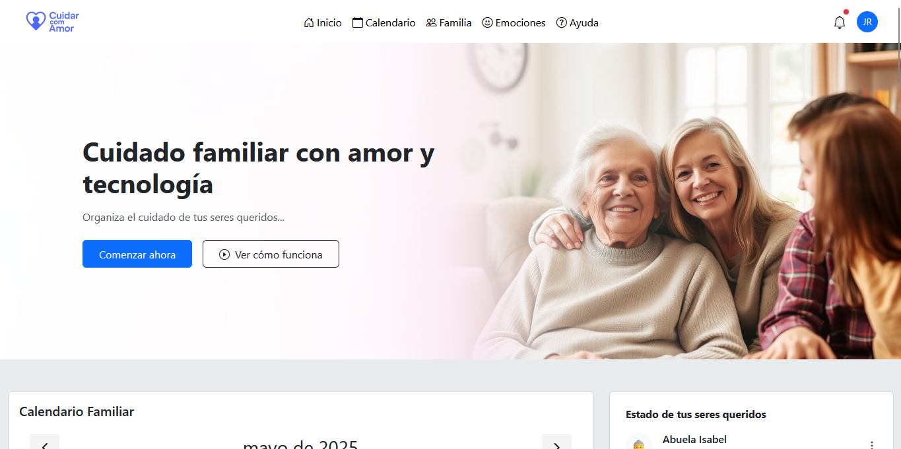
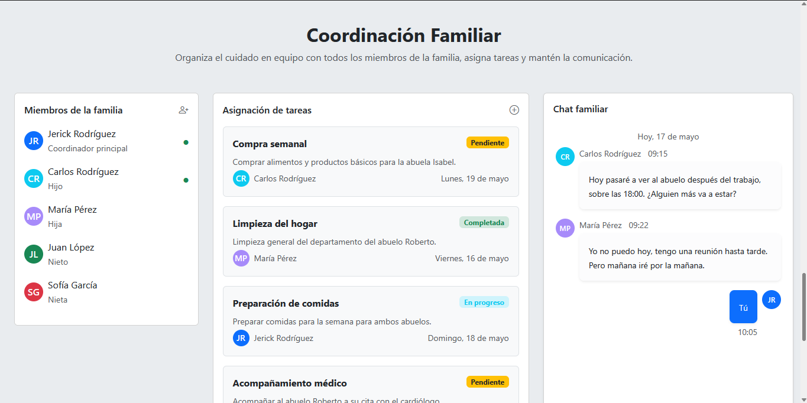
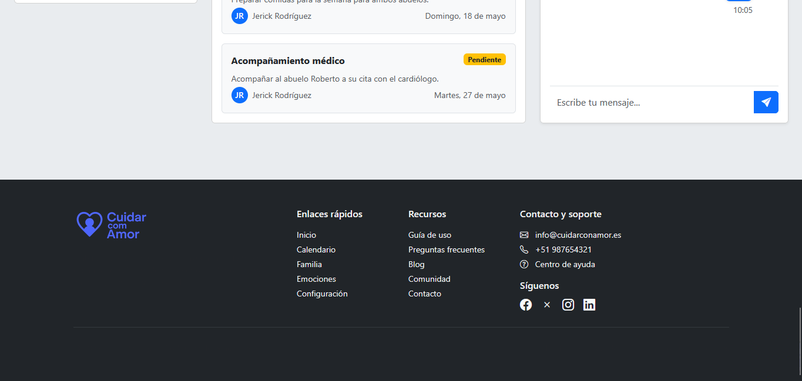

# 🧡 Cuidar com Amor

**Cuidar com Amor** é uma plataforma assistida por inteligência artificial (Google Gemini Agents) criada para ajudar famílias a organizar o cuidado com seus avós de maneira amorosa, eficiente e conectada.

---

## 🎯 Objetivo

Oferecer uma solução tecnológica acessível e empática que permita às famílias:

- Coordenar visitas, tarefas médicas e rotinas.
- Receber resumos automáticos sobre o estado emocional e físico dos avós.
- Obter ideias para fortalecer vínculos afetivos por meio de conversas.
- Registrar notas emocionais, datas importantes e lembretes.

---

## 💡 Funcionalidades Principais

- 🧠 Agentes personalizados com Gemini para interação emocional e coordenação.
- 💬 Sugestões de conversas significativas geradas por IA.
- 📌 Registro de emoções, lembranças e acompanhamento emocional.
- 📊 Backend escalável com MongoDB para salvar chats e notas.
- ✅ Versão funcional no Google Colab com testes interativos.

---

## ⚙️ Tecnologias Utilizadas

### Frontend
- HTML, CSS, JavaScript
- Bootstrap 5
- Vite (opcional)

### Backend
- Python 3 + Flask
- Google Generative AI (Gemini Agents)
- MongoDB Atlas
- Blueprints do Flask
- Pymongo, dotenv, Google Auth

---

## 🚧 Limitações do Projeto

Essa foi minha primeira experiência com Gemini Agents em Python, o que trouxe alguns desafios:

- Não consegui finalizar a integração com Google Calendar (problemas de credenciais e parsing).
- No backend Flask, apenas o **agente de emoções** (`/api/emociones`) está totalmente funcional e conectado ao MongoDB.
- No Google Colab (`colab/Cuidar_com_Amor.ipynb`) consegui executar **3 agentes** com sucesso:
  - Registro de emoções
  - Resumo do cuidado diário
  - Ideias de conversa com avós

Tive dificuldade com o idioma e usei **legendas em português** para acompanhar as aulas. Mesmo assim, continuei com empenho e carinho para entregar o projeto com o coração.

---

## 🚀 Instalação

```bash
git clone https://github.com/Jerick97/Cuidar-com-Amor.git
cd cuidar-com-amor/backend
python -m venv venv
source venv/bin/activate  # ou venv\Scripts\activate no Windows
pip install -r requirements.txt
```

Crie um `.env` com suas credenciais:

```env
GOOGLE_API_KEY=sua_api_key
MONGODB_URI=sua_mongodb_uri
```

Inicie o servidor:

```bash
flask run
```

---

## 💻 Testes com Colab

Use o notebook `colab/Cuidar_com_Amor.ipynb` para testar diretamente com IA. Ele contém o loop interativo com entrada do usuário e 3 agentes funcionais.

---

## 🤝 Contribuições

Contribuições são bem-vindas! Envie um Pull Request ou abra um Issue com sugestões ou correções.

---

## 🧠 Autor

Projeto realizado por **Emerson** para o desafio de imersão **Alura + Google Gemini**.

> _"A melhor forma de cuidar... é estar presente. Mesmo que com a ajuda da tecnologia."_

## 🖼️ Vista previa

### Interfaz principal






